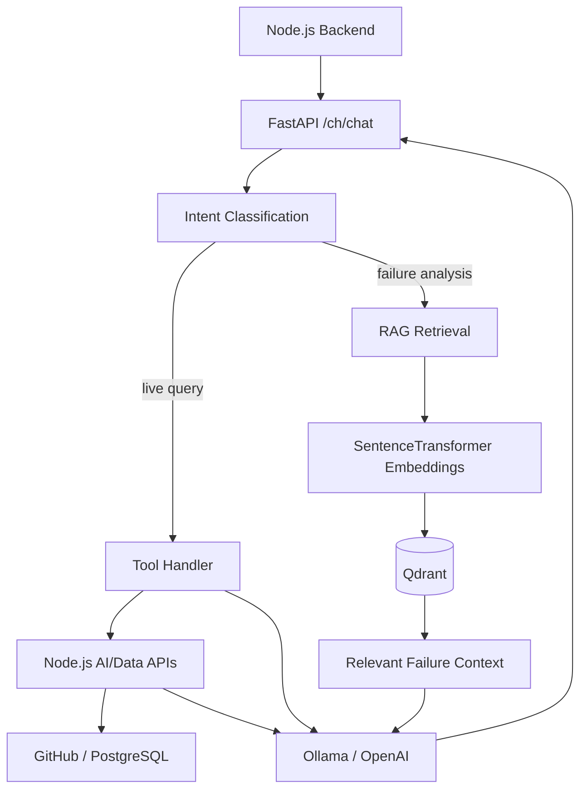
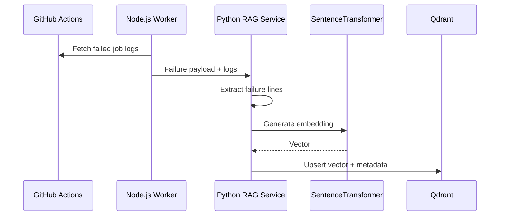

# AI DevOps Copilot — Python AI/RAG Microservice

The Python service is the **AI reasoning, tool-calling, and retrieval layer** of AI DevOps Copilot.

It is responsible for turning a natural-language DevOps question into the correct execution path: a live query against authoritative backend data, a RAG lookup over previously ingested build failures, or a general conversational response. It also owns the embedding pipeline used to convert failed CI/CD logs into searchable vector context.

The service is built with FastAPI and integrates with Qdrant, SentenceTransformers, Ollama, and OpenAI-compatible APIs.

## Core responsibilities

### 1. Intent-aware AI routing

The assistant distinguishes operational requests from failure-analysis requests and general conversation.

The current intent model includes paths such as:

- `action`
- `live_query`
- `rag`
- conversational/general handling

Examples of the intended routing behavior:

```text
"How many builds failed?"
        ↓
Live operational query
        ↓
Node.js backend API

"Show my repositories"
        ↓
Live operational query
        ↓
Node.js backend API

"Why did the build fail?"
        ↓
RAG / failure-analysis path
        ↓
Qdrant retrieval
        ↓
LLM answer grounded in retrieved context
```

The design intentionally avoids letting the model invent operational data. Live data comes from backend tools, while failure-analysis responses are grounded in the stored failure context.

## 2. Tool-calling architecture

The LLM is provided with a structured tool schema. The currently defined tools cover:

- `github_events` — workflow/build information and build-status queries
- `list_repos` — registered/unregistered repository discovery
- `single_repo_detail` — repository-specific information
- `save_repo_to_db` — repository registration

The `ToolHandler` validates the tool name, parses arguments, executes the corresponding backend operation, formats the result, and returns tool output to the LLM for the final response.

### Live-data rule

The Python service does **not** directly query PostgreSQL for normal operational questions. Instead, live tools call the Node.js backend APIs with the authenticated user's access token.

This keeps application authorization and domain-specific data access centralized in the Node service.

## Architecture



## End-to-end failure analysis

The most important pipeline in this service starts before a user asks a question.

### Ingestion

When the Node.js worker detects a failed GitHub Actions workflow, it retrieves the failed jobs and their logs from GitHub and posts a structured failure payload to:

```text
POST /rag/ingest-build-failure
```

The Python service then:

1. extracts useful failure lines from the raw logs;
2. builds a structured text representation containing repository, workflow, job, branch, commit, and failure reason;
3. generates a vector embedding using SentenceTransformers;
4. stores the embedding and metadata in Qdrant.



### Retrieval

When a user asks why a build failed, the service converts the question into the same embedding space and queries Qdrant with optional metadata filters such as:

- repository
- failure date
- branch
- failure record type

The top matching records are transformed into a context block for the LLM.

```text
User question
     ↓
Intent = RAG
     ↓
Query embedding
     ↓
Qdrant similarity search
     ↓
Optional repo/date/branch filtering
     ↓
Failure context
     ↓
LLM
     ↓
Grounded explanation
```

## LLM providers

The service supports two provider implementations behind a common interface:

### Ollama

The `OllamaProvider` uses an asynchronous Ollama client and supports tool calls. The current source uses `OLLAMA_MODEL` as the configured model name. The development configuration shown in source references `qwen2.5:7b`.

### OpenAI

The `OpenAIProvider` uses the asynchronous OpenAI client and supports the same tool-calling abstraction. The source configuration references `gpt-4.1-mini` as the OpenAI model constant, while runtime configuration can supply `OPENAI_MODEL`.

The provider is selected through:

```text
LLM_PROVIDER=ollama
```

or

```text
LLM_PROVIDER=openai
```

This abstraction allows the rest of the agent logic to remain provider-independent.

## Tool execution loop

The agent implements a bounded tool-calling loop with a maximum of two iterations.

```text
User message
   ↓
Classify intent
   ↓
Build system + conversation context
   ↓
Call LLM
   ↓
Tool call returned?
   ├── No → Final answer
   └── Yes
         ↓
     Execute tool(s)
         ↓
     Append tool results
         ↓
     Call LLM again
         ↓
     Final answer
```

Tool calls are executed asynchronously using `asyncio.gather`, allowing multiple independent tool calls returned by the model to be handled concurrently.

## RAG data model

The Qdrant collection is named:

```text
devops
```

The current vector configuration uses:

- vector size: `384`
- distance: cosine
- embedding model: configured through `EMBEDDING_MODEL`

Each build-failure point stores metadata including:

```text
repo_id
repo_name
run_number
run_attempt
run_id
job_id
job_name
workflow_name
branch
commit_sha
html_url
failure_reason
text
failure_date
created_at
updated_at
```

This combination of semantic vectors plus structured metadata allows both similarity retrieval and precise filtering.

## Failure extraction

The ingestion pipeline includes a lightweight log-reduction step before embedding. It looks for lines containing keywords such as:

`error`, `failed`, `exception`, `traceback`, `cannot`, `not found`

When matching lines exist, the service keeps the most relevant tail of those matches rather than embedding the entire raw log. When there are no keyword matches, it falls back to the last section of the log.

This keeps the retrieval representation focused on likely failure signals rather than the complete CI log stream.

## Concurrency and performance

Embedding generation is CPU/blocking work from the perspective of the asyncio event loop. The service therefore uses a `ThreadPoolExecutor` to run `SentenceTransformer.encode` outside the main async path.

The current implementation also defines an `asyncio.Semaphore(3)` for controlled concurrent embedding work.

The FastAPI lifespan creates one shared `httpx.AsyncClient` and stores it on `app.state`. The tool layer reuses that client when calling the Node.js backend instead of opening a new HTTP client for every request.

These choices are important because the service combines:

- asynchronous HTTP I/O;
- blocking embedding inference;
- concurrent tool calls;
- vector-database I/O;
- LLM calls.

## API endpoints

### Service health/root

```text
GET /
```

Returns service identity and version information.

### AI chat

```text
POST /ch/chat
```

Request body:

```json
{
  "message": "Why did the build fail?",
  "history": [],
  "ai_run_id": 123
}
```

The response includes the assistant response plus execution metadata such as:

- prompt tokens
- completion tokens
- total tokens
- latency
- AI run ID
- model
- provider

### RAG ingestion

```text
POST /rag/ingest-build-failure
```

Accepts structured failed-build data from the Node.js worker and stores a searchable representation in Qdrant.

### Concurrency test endpoint

```text
GET /rag/test/thread
```

This endpoint exercises the embedding concurrency path and reports the number of generated embeddings and elapsed time. It is primarily useful as an implementation/test hook rather than a production feature.

## Project structure

```text
app/
├── ai_agent/
│   ├── main.py                # Agent execution loop
│   ├── provider.py            # Ollama/OpenAI provider abstraction
│   ├── intents.py             # Intent classification
│   ├── prompts.py             # AI DevOps system instructions
│   ├── took_schema.py         # Tool/function schemas
│   ├── tools.py               # Live backend tools
│   └── tool_handler.py        # Tool execution + RAG context assembly
├── db/
│   └── index.py               # Qdrant + embedding model initialization
├── rag/
│   └── index.py               # Ingestion, embeddings, retrieval
├── routes/
│   ├── chat.py                # AI chat endpoint
│   └── rag.py                 # RAG endpoints
├── helper/
│   ├── schema.py              # Pydantic request/response models
│   ├── general.py             # Failure enrichment + latency helpers
│   └── formatters.py          # Tool-result formatting
├── utils/
│   ├── validator.py           # Request/intent helpers
│   └── threadPoolExecutor.py  # Async wrapper around embedding threads
└── main.py                    # FastAPI application/lifecycle
```

## Configuration

The service reads configuration from environment variables.

### LLM

```text
LLM_PROVIDER
OLLAMA_HOST
OLLAMA_MODEL
OPENAI_API_KEY
OPENAI_MODEL
```

### Embeddings / model access

```text
EMBEDDING_MODEL
HF_TOKEN
```

### Vector database

```text
QDRANT_HOST
QDRANT_PORT
```

### Node.js backend

```text
NODE_BACKEND
```

The Node.js URL is used by the live tools for repository/build operations and by the assistant when it needs authoritative application data.

## Running the service

The source archive supplied for this review contains the application source but does not include the dependency manifest. Therefore this README intentionally avoids inventing Python package versions or install commands.

Use the actual repository's dependency file (`requirements.txt`, `pyproject.toml`, or equivalent) to install dependencies and start the FastAPI service with the project's configured ASGI command.

The runtime also requires:

- a reachable Qdrant instance;
- the configured embedding model and, when necessary, Hugging Face authentication;
- an Ollama runtime or OpenAI API access depending on `LLM_PROVIDER`;
- a reachable Node.js backend;
- network connectivity from the microservice to those dependencies.

## Design principles

### Authoritative data over model memory

For operational questions, the agent uses backend tools rather than asking the LLM to invent current state.

### RAG for failure context, not general truth

The vector store is specialized around ingested build failures. It is not treated as a general-purpose database for every platform fact.

### Provider abstraction

LLM-specific code is isolated behind provider classes so agent logic can switch between local Ollama inference and OpenAI without changing the tool/router architecture.

### Async-first service boundary

FastAPI, async HTTP clients, asynchronous Qdrant access, and concurrent tool execution are combined with thread offloading for blocking embedding inference.

### Bounded agent execution

The tool loop is intentionally bounded rather than allowing unbounded model/tool recursion. This gives the agent predictable execution behavior.

## Related services

This microservice is one part of the AI DevOps platform:

- **AI DevOps Frontend** — developer-facing operations console and chat UI.
- **AI DevOps Node.js Backend** — authentication, persistence, GitHub/Kubernetes integrations, queues, and controlled live-data APIs.
- **AI DevOps Python Microservice** — this repository: agent routing, tool calling, embeddings, RAG, and LLM provider integration.
